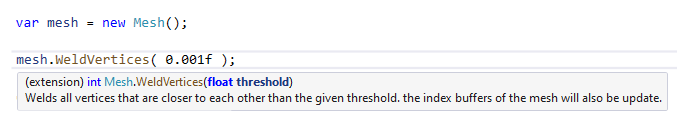

# About MeshUtil

MeshUtil is a small package that extends the Unity Mesh class.
MeshUtil provides methods like WeldVertices() or RemoveDuplicateTriangles().

# Installing MeshUtil

To install this package, follow the instructions in the [Package Manager documentation](https://docs.unity3d.com/Packages/com.unity.package-manager-ui@latest/index.html). 

<a name="UsingPackageName"></a>
# Using MeshUtil

Add a reference to MeshUtil in the code files wou would like to use it in.

```csharp
#using de.JochenHeckl.MeshUtil;
```

Now you should be able to simply use the extensions like this:



# Technical details
## Requirements

This version of MNeshUtil is compatible with the following versions of the Unity Editor:

* 2019.3 and later (recommended)
* 2017.1 and later (not tested, no guarantees this works, but as this is a very straight and simple package it should work with pretty much every unity version )


## Document revision history
|Date|Reason|
|---|---|
|Jan 22, 2020|Document created. Matches package version 1.0.|
>>>